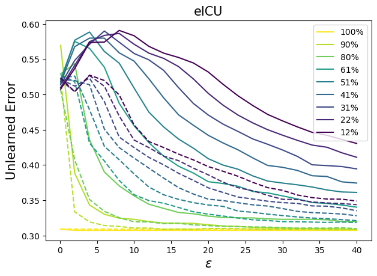
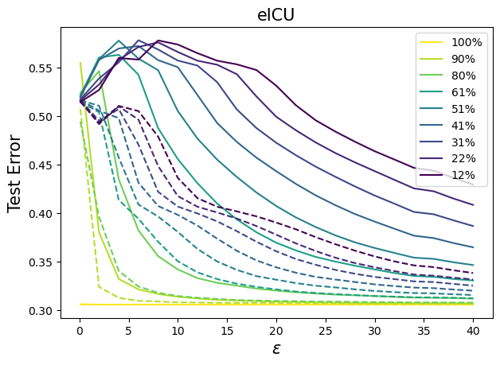
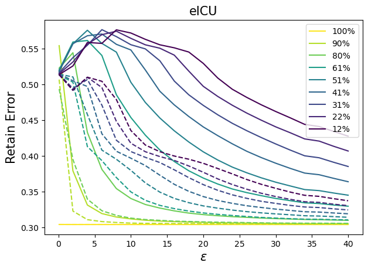
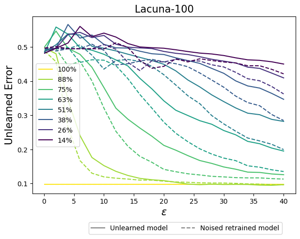
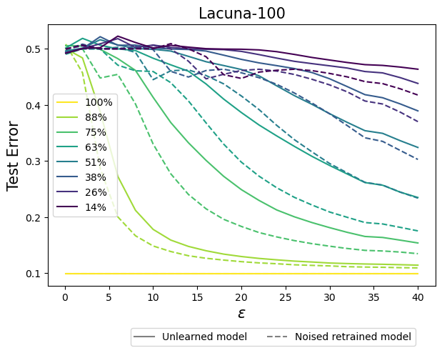
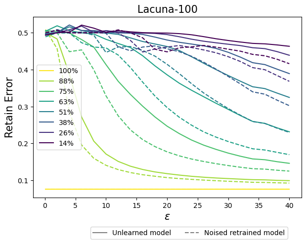

# R2D: Rewind-To-Delete


## Overview
This repository contains the code and scripts used for the experiments in our paper, "Rewind-To-Delete: Certified Machine Unlearning for Nonconvex Functions."


### Prerequisites
Package dependencies are included in `r2d.yml`

## Datasets
Download the MAAD-Face annotations here: https://github.com/pterhoer/MAAD-Face

MAAD-Face preprocessing procedure and Lacuna-100 generation from VGGFace2 are in `lacuna_maad_preprocessing_binary.ipynb`

To access the eICU dataset, follow the instructions here: https://eicu-crd.mit.edu/gettingstarted/access/

## Training the Model
To train the model from scratch, run:
```sh
python3 main.py  --dataset lacuna100binary128 --model resnetsmooth --dataroot data/lacuna100binary128/ --epochs 100 --lr 0.1 --batch-size 256 --compute-lipschitz --scheduler 0.9 --model-selection --save-checkpoints
```
## Plots for Reviewer vYe7

### Impact of Varying Unlearned Ratio $m/n$ on $\sigma$ and Test Error

<p float="left">
  
   
</p>

<p float="left">
  
   
</p>

### $K$ vs. $\sigma$
<p float="left">
  
   
</p>

### $\epsilon$ vs. $\sigma$
<p float="left">
  
   
</p>

### Figures 1abc
<p float="left">
  
   
   
</p>

<p float="left">
  
   
   
</p>


## Performance of Noised Retrained Model

### eICU Dataset





Below we also provide numerical results for $\epsilon = 40$ of the noised retrained model. These results will be added to Table 8 and 9.

| Noise Level    | Retrained Unlearned Error | Retrained Test Error | Retrained Retain Error | Retrained MIA Score |
|---------------|----------------|------------|-------------|-----------|
| R2D, 22%     | 0.3108          | 0.3115     | 0.3095      | 0.5004    |
| R2D, 41%     | 0.3031          | 0.3091     | 0.3071      | 0.5027    |
| R2D, 61%     | 0.3043          | 0.3075     | 0.3061      | 0.5047    |
| R2D, 80%     | 0.3001          | 0.3073     | 0.3052      | 0.5066    |

### Lacuna-100 Dataset






Below we also provide numerical results for $\epsilon = 40$ of the noised retrained model. These results will be added to Table 8 and 9.

| Noise Level    | Retrained Unlearned Error | Retrained Test Error | Retrained Retain Error | Retrained MIA Score |
|---------------|----------------|------------|-------------|-----------|
| R2D, 26%     | 0.3780          | 0.3826     | 0.3784      | 0.5591    |
| R2D, 51%     | 0.1745          | 0.1969     | 0.1948      | 0.5735    |
| R2D, 75%     | 0.1002          | 0.1210     | 0.1103      | 0.5731    |
